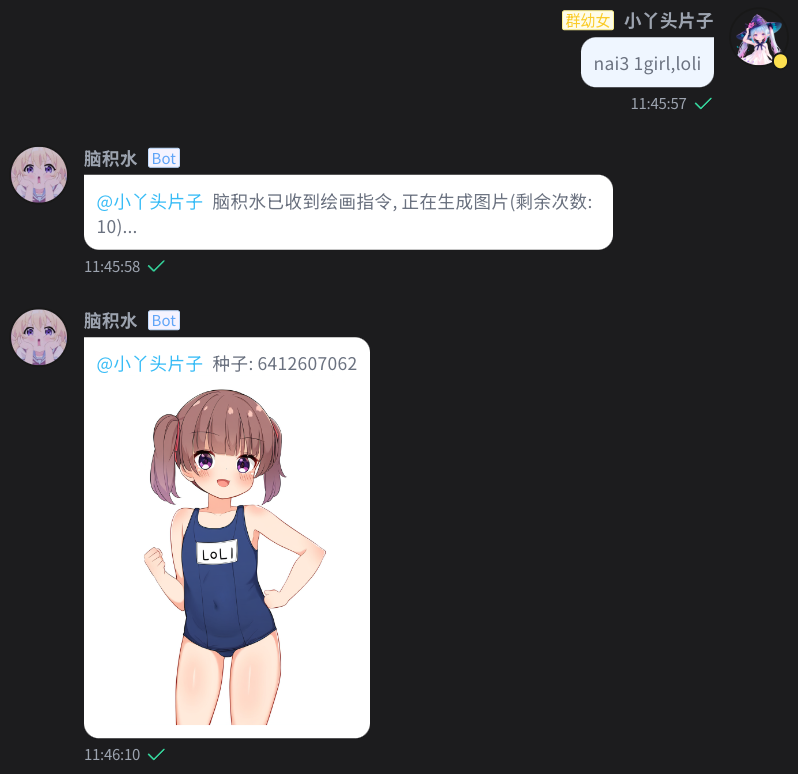

<div align="center">
  <a href="https://v2.nonebot.dev/store"></a>
  <br>
  <p></p>
</div>

<h1 align="center">nonebot_plugin_nai3</h1>
<h4 align="center">✨通过 NovelAI 生成图片✨</h4>

<p align="center">
    
    <a href="https://github.com/zhulinyv/nonebot_plugin_nai3/raw/main/LICENSE"></a>
    
    
    
</p>

## 💬 介绍

通过 Post 请求 NovelAI 官网生成图片, **因此你需要购买 NovelAI 会员才可以使用本插件**

## 💿 安装

<details>
<summary>使用 nb-cli 安装</summary>
在 nonebot2 项目的根目录下打开命令行, 输入以下指令即可安装

    nb plugin install nonebot-plugin-nai3

</details>

<details>
<summary>使用包管理器安装</summary>
在 nonebot2 项目的插件目录下, 打开命令行, 根据你使用的包管理器, 输入相应的安装命令

<details>
<summary>pip</summary>

    pip install nonebot-plugin-nai3
</details>
<details>
<summary>pdm</summary>

    pdm add nonebot-plugin-nai3
</details>
<details>
<summary>poetry</summary>

    poetry add nonebot-plugin-nai3
</details>
<details>
<summary>conda</summary>

    conda install nonebot-plugin-nai3
</details>

打开 nonebot2 项目根目录下的 `pyproject.toml` 文件, 在 `[tool.nonebot]` 部分追加写入

    plugins = ["nonebot_plugin_hoshino_sign"]

</details>

## ⚙️ 配置

在 nonebot2 项目的`.env`文件中添加下表中的必填配置

| 配置项 | 必填 | 类型 | 默认值 | 说明 |
|:-----:|:----:|:----:|:----:|:----:|
| nai3_token | 是 | str | xxx | 请求头中必需的 token |
| nai3_negative | 否 | str | nsfw,... | 负面提示词 |
| nai3_limit | 否 | int | 10 | 每人最多生成次数 |
| nai3_cooltime_group | 否 | int | 30 | 群聊画图冷却时间(单位: 秒) |
| nai3_cooltime_user | 否 | int | 300 | 个人画图冷却时间(单位: 秒) |

⚠️ token 的获取:

- 1.登录 https://novelai.net/login
- 2.F12 打开控制台并切换到控制台
- 3.输入 `console.log(JSON.parse(localStorage.session).auth_token)` 回车, 返回的字符串即为 token
- 

## 🎉 使用

```
指令: nai3/nai
参数:
    prompt          提示词(支持你喜欢的画风串), 默认: None
    -n/--negative   负面提示词, 默认: nsfw,...
    -r/--resolution 画布形状/分辨率, ["mb", "pc", "sq"] 三选一, 默认: mb
    -s/--scale      提示词相关性, 默认: 5.0
    -sm             sm, 默认: False
    -smdyn          smdyn, 默认: False
    --sampler       采样器, 默认: k_euler
    --schedule      噪声计划表, 默认: native
示例: nai3 1girl, loli, cute -r mb -s 5.0
返回: 
```



## 📖 待办

+ [x] 文生图
+ [ ] 图生图
+ [x] 自定义参数
+ [ ] 队列功能
+ [x] 冷却功能
+ [x] 上限功能
+ [ ] 黑名单功能
+ [ ] 代理
+ [ ] R18 检测
+ [ ] 翻译
+ [ ] 帮助指令
+ [ ] ...

## 🤝 鸣谢

本项目逐步迁移自 [Semi-Auto-NovelAI-to-Pixiv](https://github.com/zhulinyv/Semi-Auto-NovelAI-to-Pixiv) 


<hr>
</img>
